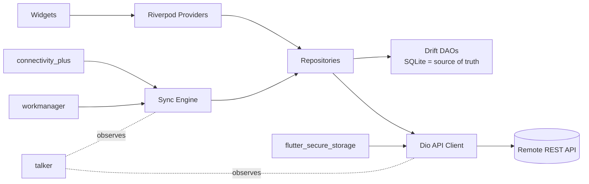
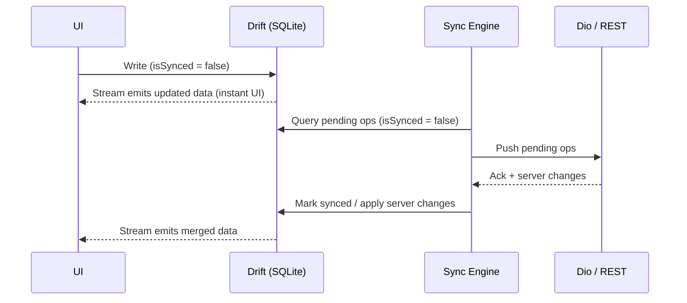

# Tech Stack — Offline-First Flutter App

This document describes the recommended technology stack for building an
offline-first Flutter application: local data is the source of truth, the
network is an optimization, and synchronization happens in the background.

## Stack Overview

| Layer | Tool / Package | Role |
| --- | --- | --- |
| UI / state | **Riverpod** | App state, dependency injection |
| Networking | **Dio** | REST API, interceptors, retries |
| Local DB | **Drift (SQLite)** | Persistent offline data + queries |
| Serialization | **Freezed + json_serializable** | Immutable models / JSON |
| Connectivity | **connectivity_plus** | Detect network changes |
| Background sync | **workmanager** | Periodic/background synchronization |
| Secure credentials | **flutter_secure_storage** | Tokens/credentials |
| Logging | **talker** / standard logging | Sync/network diagnostics |

## Architecture



**Core principle:** the UI never talks to the network directly. Widgets read
from Drift (via streams exposed through Riverpod). Writes go to SQLite first
and are pushed to the server by the sync engine when connectivity allows.

---

## 1. UI / State — Riverpod

**Package:** `flutter_riverpod`

- Compile-safe dependency injection and reactive state management.
- Expose Drift queries as `StreamProvider`s so widgets rebuild automatically
  when local data changes (including changes made by background sync).
- Use `Notifier` / `AsyncNotifier` for mutable state and mutations.
- Use `ProviderScope` overrides in tests to swap repositories and API clients.

```dart
final todosProvider = StreamProvider<List<Todo>>(
  (ref) => ref.watch(todoDaoProvider).watchAll(),
);
```

Docs: <https://riverpod.dev>

---

## 2. Networking — Dio

**Package:** `dio`

- REST client with interceptors for auth headers, token refresh, retries, and
  logging.
- Attach an auth interceptor that reads tokens from `flutter_secure_storage`.
- Attach a retry interceptor (e.g. `dio_smart_retry`) with exponential backoff
  for idempotent requests.
- Route Dio logs through talker (`TalkerDioLogger`) for unified diagnostics.

```dart
final dioProvider = Provider<Dio>((ref) {
  final dio = Dio(BaseOptions(baseUrl: 'https://api.example.com'));
  dio.interceptors.addAll([
    AuthInterceptor(ref.read(secureStorageProvider)),
    RetryInterceptor(dio: dio),
    TalkerDioLogger(talker: ref.read(talkerProvider)),
  ]);
  return dio;
});
```

Docs: <https://pub.dev/packages/dio>

---

## 3. Local Database — Drift (SQLite)

**Packages:** `drift`, `drift_flutter`, dev: `drift_dev`, `build_runner`

- Type-safe, reactive SQLite persistence — the offline source of truth.
- Define tables in Dart; Drift generates DAOs and data classes.
- All queries can be exposed as `Stream`s, which pair naturally with Riverpod
  `StreamProvider`s.
- Store a `syncStatus` / `updatedAt` column (or a dedicated `pending_ops`
  outbox table) on syncable entities so the sync engine knows what to push.

```dart
class Todos extends Table {
  TextColumn get id => text()();
  TextColumn get title => text()();
  BoolColumn get completed => boolean().withDefault(const Constant(false))();
  DateTimeColumn get updatedAt => dateTime()();
  BoolColumn get isSynced => boolean().withDefault(const Constant(false))();

  @override
  Set<Column> get primaryKey => {id};
}
```

Docs: <https://drift.simonbinder.eu>

---

## 4. Serialization — Freezed + json_serializable

**Packages:** `freezed_annotation`, `json_annotation`, dev: `freezed`,
`json_serializable`, `build_runner`

- Immutable model classes with `copyWith`, `==`, and `toString` for free.
- `fromJson` / `toJson` generated via `json_serializable` for API payloads.
- Keep **API DTOs** (Freezed models) separate from **Drift rows**; map between
  them in the repository layer. This isolates schema changes on either side.

```dart
@freezed
class TodoDto with _$TodoDto {
  const factory TodoDto({
    required String id,
    required String title,
    @Default(false) bool completed,
    required DateTime updatedAt,
  }) = _TodoDto;

  factory TodoDto.fromJson(Map<String, dynamic> json) =>
      _$TodoDtoFromJson(json);
}
```

Codegen command:

```sh
dart run build_runner build --delete-conflicting-outputs
```

Docs: <https://pub.dev/packages/freezed> ·
<https://pub.dev/packages/json_serializable>

---

## 5. Connectivity — connectivity_plus

**Package:** `connectivity_plus`

- Emits a stream of connectivity changes (wifi / mobile / none).
- Feed it into the sync engine via a Riverpod provider: when the device comes
  back online, trigger an immediate sync push/pull.
- Treat "connected" as *possibly* online — always confirm with a real request,
  since captive portals can report connectivity without internet access.

```dart
final connectivityProvider = StreamProvider<List<ConnectivityResult>>(
  (ref) => Connectivity().onConnectivityChanged,
);
```

Docs: <https://pub.dev/packages/connectivity_plus>

---

## 6. Background Sync — workmanager

**Package:** `workmanager`

- Schedules periodic background tasks (Android WorkManager / iOS BGTask).
- Register a top-level `callbackDispatcher` that runs the sync engine even
  when the app is not in the foreground.
- Combine three sync triggers:
  1. **Immediate** — after a local write, attempt a push right away.
  2. **Reactive** — when `connectivity_plus` reports we're back online.
  3. **Periodic** — `workmanager` task as a safety net (min ~15 min on
     Android; iOS timing is system-controlled).

```dart
@pragma('vm:entry-point')
void callbackDispatcher() {
  Workmanager().executeTask((task, inputData) async {
    await SyncEngine().sync();
    return true;
  });
}
```

Docs: <https://pub.dev/packages/workmanager>

---

## 7. Secure Credentials — flutter_secure_storage

**Package:** `flutter_secure_storage`

- Stores auth tokens / refresh tokens in the platform keystore
  (Android Keystore, iOS Keychain).
- Read by the Dio auth interceptor; refreshed tokens are written back here.
- Never persist credentials in Drift or shared preferences.

```dart
final secureStorageProvider =
    Provider<FlutterSecureStorage>((_) => const FlutterSecureStorage());
```

Docs: <https://pub.dev/packages/flutter_secure_storage>

---

## 8. Logging — talker

**Packages:** `talker`, `talker_flutter`, `talker_dio_logger`

- Centralized, filterable logs for network requests and sync operations —
  critical for diagnosing offline/online edge cases in the field.
- Use `TalkerDioLogger` to capture every request/response automatically.
- Log sync runs (started, pushed N ops, conflicts, failures) so issues can be
  traced from an in-app log screen (`TalkerScreen`) or exported.

```dart
final talkerProvider = Provider<Talker>((_) => Talker());
```

Docs: <https://pub.dev/packages/talker>

---

## Sync Engine Flow



**Conflict strategy (recommended default):** last-write-wins using
`updatedAt` timestamps, with the option to promote specific entities to
explicit conflict resolution later.

## Recommended pubspec Additions

```yaml
dependencies:
  flutter_riverpod: ^2.6.1
  dio: ^5.7.0
  drift: ^2.22.0
  drift_flutter: ^0.2.4
  freezed_annotation: ^2.4.4
  json_annotation: ^4.9.0
  connectivity_plus: ^6.1.0
  workmanager: ^0.5.2
  flutter_secure_storage: ^9.2.2
  talker: ^4.5.0
  talker_flutter: ^4.5.0
  talker_dio_logger: ^4.5.0

dev_dependencies:
  build_runner: ^2.4.13
  drift_dev: ^2.22.0
  freezed: ^2.5.7
  json_serializable: ^6.9.0
```

> Verify the latest versions on <https://pub.dev> before adding; pin versions
> in a real project.
